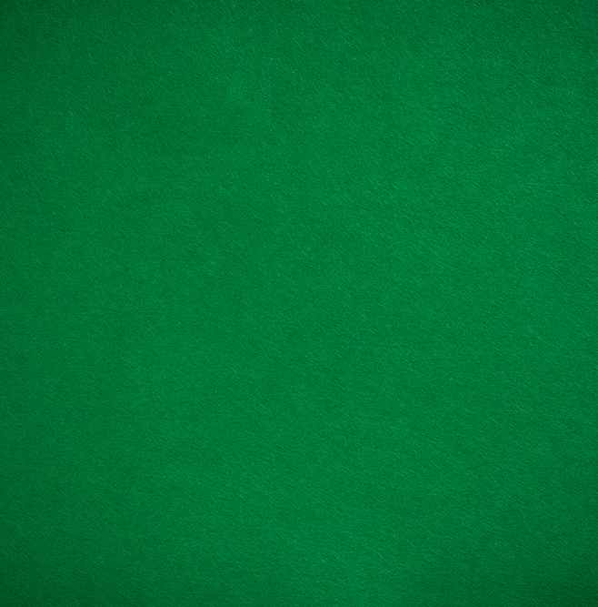

# Blackjack Game

A fully functional browser-based Blackjack game built with HTML, CSS, and JavaScript.



## Features

- Classic Blackjack gameplay
- Random card generation (with Ace as 11 and face cards as 10)
- Real-time score calculation
- Win, lose, and Blackjack detection
- Clean and responsive UI with a casino table background
- Restart functionality to play again

## How to Play

1. Click **START GAME** to deal two cards
2. Click **NEW CARD** to draw additional cards (as long as you're under 21)
3. Try to get as close to **21** as possible without going over
4. Click **RESTART** to reset the game at any time

## Technologies Used

- **HTML5** - Structure
- **CSS3** - Styling and layout
- **JavaScript (Vanilla)** - Game logic and DOM manipulation

## Live Demo

*(Add your deployed link here if you host it on GitHub Pages, Netlify, or Vercel)*

## Setup

1. Clone the repository:
   ```bash
   git clone <your-repo-link>
